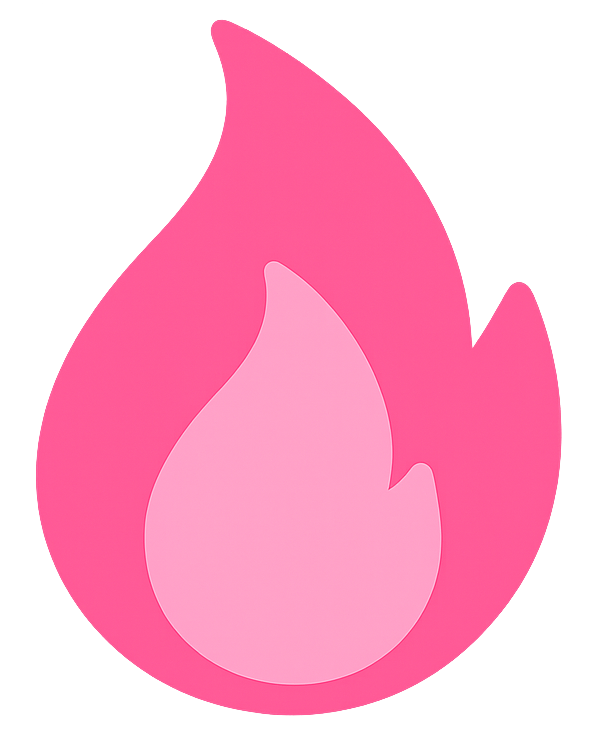

## 🌸 Olá, eu me chamo Alana Sousa!

Eu sou estudante de Ciências da Computação e possuo foco principal em desenvolvimento web back-end. Tenho experiência em linguagens como PHP, C, C++ e Java. Estou sempre em busca de novas oportunidades para aplicar e expandir meus conhecimentos práticos na área da computação.

##  Estatísticas Gerais:
  

    
    

##  Commits:

    

## 🌷 Linguagens e Ferramentas:

  
 
    
    
    
    
    
    
    ✦
    
    
    
  

## 🌺 Contatos:

 
  
  
   
  

